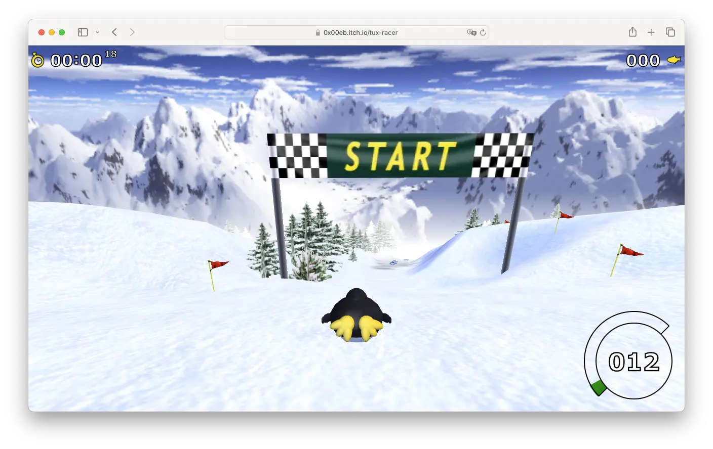

# TuxRacer.js

You can play Tux Racer directly in your browser here: [Play TuxRacer.JS](https://0x00eb.itch.io/tux-racer)



TuxRacer.js is a port / rewrite of *Extreme Tux Racer*, which itself is based on the original *Tux Racer* game. This project allows you to enjoy Tux Racer directly in your web browser, supporting all major desktop and mobile browsers.

**Note:** This project is in an early development stage and far from complete. However, some courses are already functional enough to provide a fun experience (at least for me!).

---

## How to Run TuxRacer.JS

### Prerequisites
- A recent version of Node.js (I'm using v22, but other versions may work as well)

### Steps
1. Clone or download the repository:
   ```sh
   git clone https://github.com/ebbejan/tux-racer-js.git
   cd tuxracer-js
   ```
2. Install dependencies:
   ```sh
   npm install
   ```
3. Start the development server:
   ```sh
   npm run dev
   ```
4. Open the URL provided in the terminal output in your web browser.
5. Enjoy!

---

## How to Play

### Controls
- **Desktop:** Use either the keyboard (WASD or arrow keys) or the mouse to control Tux.
- **Mobile:** Control Tux using touch input via a virtual joystick.

### Tips
- **Paddling forward** helps Tux gain initial speed but is slowing down once he reaches high velocity.
- **Braking** is useful for mastering tight turns.
- **Terrain types** significantly impact Tux's acceleration and handling.

### Selecting a Course
By default, the game starts on *Bunny Hill*, but you can switch to a different course using the `course` URL query parameter.

To play a specific course, add `?course=course-name` to the URL. For example:
```
http://localhost:5173/?course=frozen-river
```
Below is a list of available courses and their corresponding parameters:

| Course Name  | URL Parameter |
| ------------ | ------------- |
| Bunny Hill (default) | bunny-hill  |
| Frozen River | frozen-river  |
| Challenge One | challenge-one  |
| Chinese Wall | chinese-wall  |
| Downhill Fear | downhill-fear  |
| Explore Mountains | explore-mountains  |
| Frozen Lakes | frozen-lakes  |
| Hippo Run | hippo-run  |
| Holy Grail | holy-grail  |
| In Search of Vodka | in-search-of-vodka  |
| Milos Castle | milos-castle  |
| Path of Daggers | path-of-daggers  |
| Penguins Can't Fly | penguins-cant-fly  |
| Quiet River | quiet-river  |
| Secret Valleys | secret-valleys  |
| This Means Something | this-means-something  |
| Tux at Home | tux-at-home  |
| Twisty Slope | twisty-slope  |
| Wild Mountains | wild-mountains  |
| Bumpy Ride | bumpy-ride  |

### Changing the Environment
The game also supports different environments, which can be selected using the `environment` URL query parameter.

To change the environment, add `?environment=environment-name` to the URL. For example:
```
http://localhost:5173/?environment=night
```
Here are the available environments:

| Environment | URL Parameter |
| ----------- | ------------- |
| Sunny (default) | sunny  |
| Night | night  |
| Cloudy | cloudy  |

You can also combine parameters, for example:
```
http://localhost:5173/?course=downhill-fear&environment=night
```
This would start the game on *Downhill Fear* with a *Night* environment.

---

## Contributing
Contributions are welcome! Feel free to submit issues, feature requests, or pull requests.

---

## Credits

### Original *Extreme Tux Racer* Team
- Steven Bell
- Kristian Picon
- Nicosmos
- R. Niehoff
- Philipp Kloke
- Marko Lindqvist

### Original *Tux Racer* Authors
- Eric Hall
- Jasmin Patry
- Mark Riddell
- Patrick Gilhuly
- Rick Knowles
- Vincent Ma

### Music
- Grady O'Connell
- Kristian Picon
- Karl Schroeder
- Joseph Toscano

### Graphics
- Nicosmos
- Kristian Picon
- Daniel Poeira

### TuxRacer.js Development
- Developed by Jan Ebbe

---

## License
TuxRacer.js is licensed under the **GNU General Public License v2.0**. For the complete license text, see the file [`LICENSE`](LICENSE).

